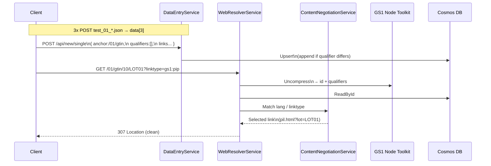

# Architecture – GS1 Digital Link Resolver CE (.NET 8)

This document describes the architecture and runtime behavior of the
.NET 8 port of the GS1 Digital Link Resolver CE.

---

## 🏗️ High-Level Overview

The system is implemented as **three stateless microservices**,
orchestrated via Docker Compose (or AKS in production):

1. **DataEntryService**
2. **WebResolverService**
3. **TestHarnessService**

Azure Cosmos DB is used as the persistent backend.
The official GS1 Node.js toolkit is executed as a real subprocess.

---

## 🧩 Services

### 1. DataEntryService (Port 3000)

**Purpose**
- Authenticated CRUD for GS1 linksets

**Responsibilities**
- Accept GS1 v3 JSON payloads
- Merge or append qualifier groups
- Upsert documents into Cosmos DB

**Security**
- Bearer token authentication (`SESSION_TOKEN`)

---

### 2. WebResolverService (Port 4000)

**Purpose**
- Public-facing GS1 Digital Link resolver

**Responsibilities**
- Parse GS1 paths
- Expand or compress identifiers
- Fetch linksets from Cosmos DB
- Apply content negotiation rules
- Return:
  - `307` redirect
  - `300` linkset JSON
  - `Link` headers

---

### 3. TestHarnessService (Port 5000)

**Purpose**
- GS1 compliance test UI

**Responsibilities**
- Execute official GS1 test scenarios
- Validate resolver behavior end-to-end

**Note**
- Development & validation only
- Not required in production deployments

---

## 🗄️ Data Layer

### Azure Cosmos DB

- Container: `resolver_test_v4`
- Partition key: `/Id`
- Document model mirrors GS1 CE Mongo schema
- Multiple `data[]` entries per anchor

---

## 🔧 GS1 Toolkit Integration

- Real Node.js GS1 Digital Link toolkit
- Executed via `Process.Start`
- Used for:
  - Path compression
  - Path expansion
  - Validation

**No mocks** are used in E2E tests.

---

## 🔁 Content Negotiation

Negotiation hierarchy exactly matches the GS1 CE reference implementation:

1. Language (`Accept-Language`, q-values)
2. Context & media
3. `und`
4. First available link

---

## 🔄 End-to-End Flow (Textual)

1. GS1 linksets are preloaded via the DataEntryService
2. Documents are upserted into Cosmos DB
3. Client resolves a Digital Link URL
4. Resolver expands identifiers using the GS1 toolkit
5. Linkset is loaded from Cosmos DB
6. Content negotiation selects the best match
7. Resolver returns a clean `307 Location` redirect

---

## 🔁 End-to-End Sequence Diagram

---

## ⚡ Performance Notes

- Performance characteristics are **theoretical**
- Stateless services allow horizontal scaling
- Expected low-latency resolution with proper indexing
- Cosmos DB RU provisioning determines throughput

---

## ☁️ Deployment

Recommended production setup:

- Azure Cosmos DB
- AKS or Azure App Service
- NGINX as public resolver proxy

---

## 📜 Specification Compatibility

- GS1 Digital Link Resolver CE (archived Python reference)
- Linkset v3 JSON format
- Fully compatible with the GS1 test harness
